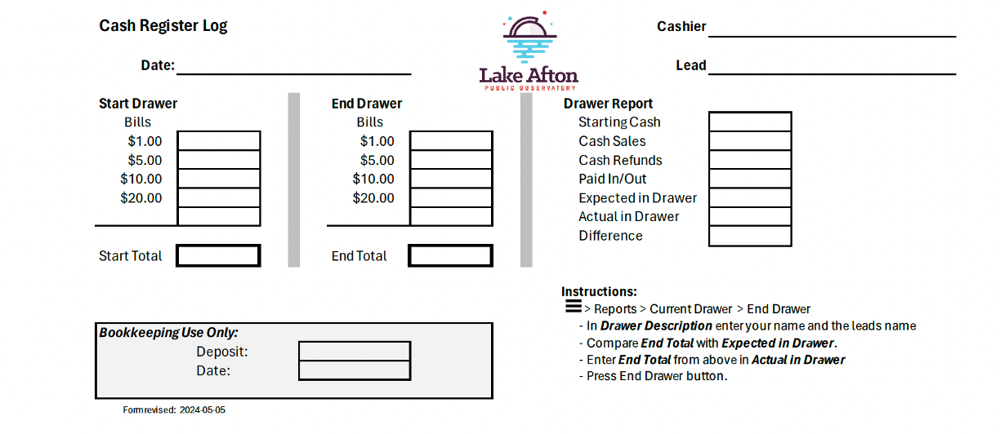
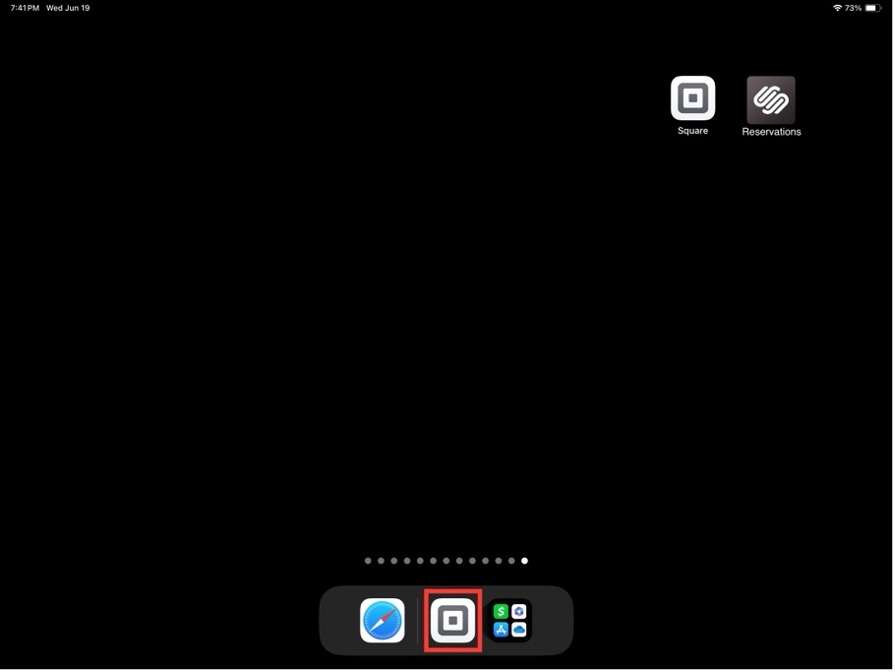
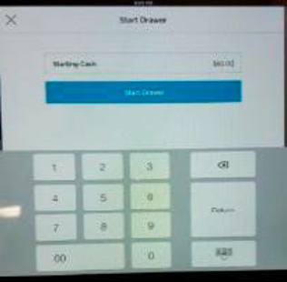
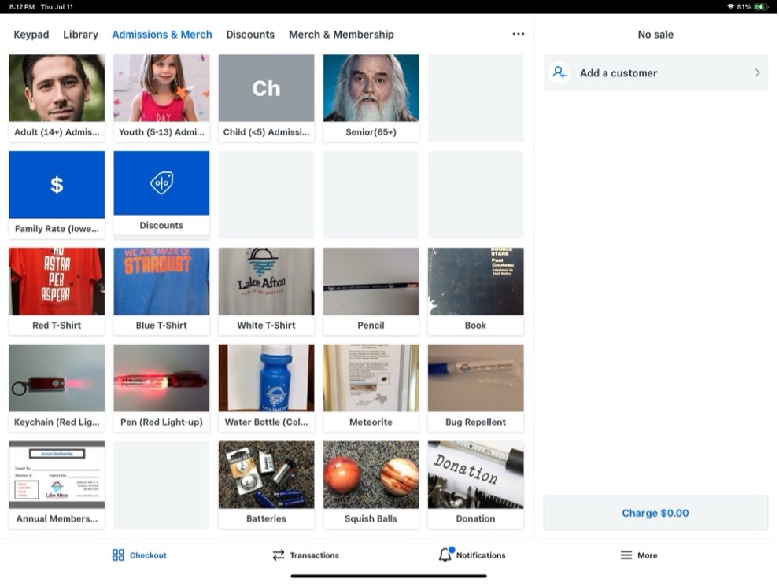
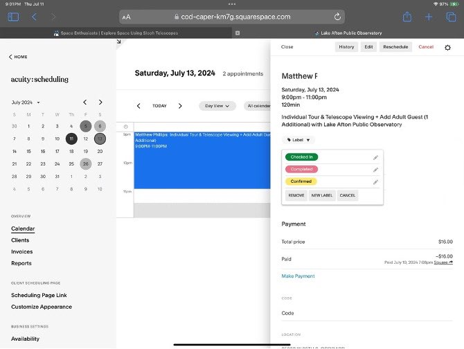
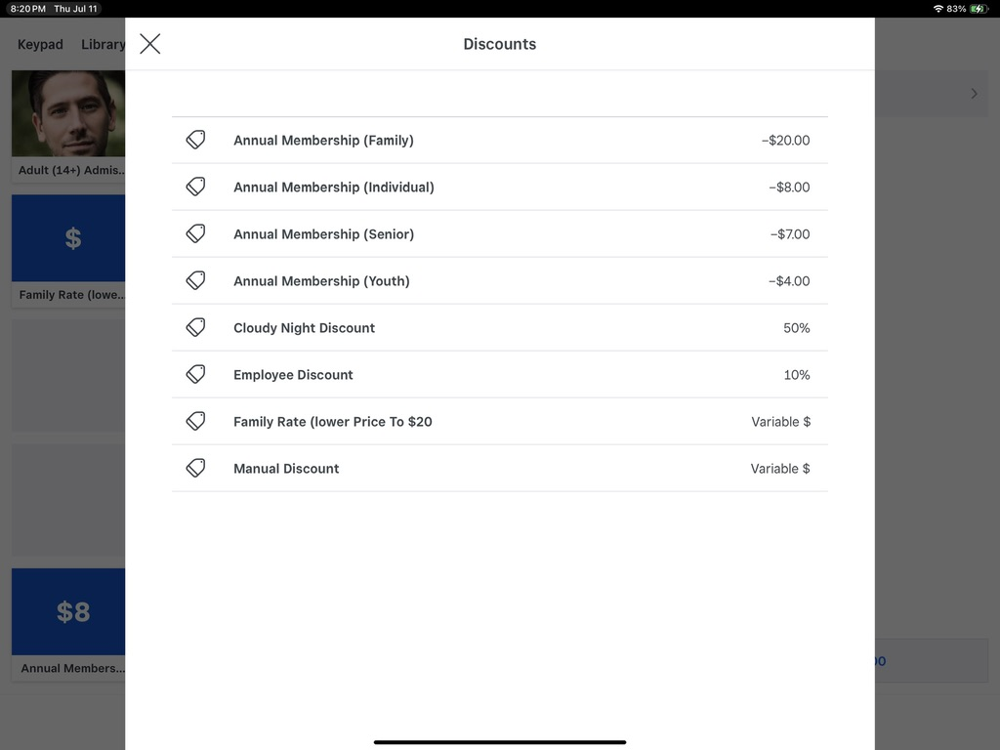

---
title: Admission and Register
weight: 6
lastmod: "2024-07-18"
reviewer: "Chris Ketron"
notes: ""

---

- [Admission](#admission)
- [Annual Passes](#annual-passes)
- [Cash Register Start-up Procedure](#cash-register-start-up-procedure)
- [Cash Register Transaction](#cash-register-transaction)
- [Reservations](#reservations)
- [Private Events](#private-events)
- [Cash Register Shutdown Procedure](#cash-register-shutdown-procedure)
- [Transaction Scenarios](#transaction-scenarios)
  - [Discounts](#discounts)
  - [Family Rate Discount](#family-rate-discount)
  - [Family Rate, Annual Pass, Extended Family](#family-rate-annual-pass-extended-family)
  - [Admission with Annual Pass Purchase](#admission-with-annual-pass-purchase)
  - [Initial Admission with later Annual Pass Purchase](#initial-admission-with-later-annual-pass-purchase)
  - [Senior, Military, SG County Employee, and Cloudy Night Discounts](#senior-military-sg-county-employee-and-cloudy-night-discounts)
  
---

[top](#)

## Admission

We accept cash or credit/debit cards

|Age|Admission|
|---|---:|
|Adults (14+)|$8|
|Seniors (65+)|$7|
|Children (5-13)|$4|
|Children (under 5)|Free|
|Family Rate (2 adults and their children)|	$20 |

[top](#)

## Annual Passes

We offer guests the opportunity to purchase Annual Passes that allow them free admission for a year, and a monthly newsletter email. Annual Admission Passes are available for individuals, youths, seniors and families.  

If they purchase the annual pass during their visit, they can apply their admission as discount to the purchase of the annual pass (scenario covered later).  

Have the guest complete an Annual Pass Card to collect their details, ring up the purchase transaction and then provide the Annual Pass card to the evening lead.  

The lead will enter the guests information into our membership database and produce the laminated membership card to be handed to the guest during their visit – usually only takes about 10 minutes to complete.

[top](#)

## Cash Register Start-up Procedure

1. Your lead for the night will get the starting cash, the key, and the iPad out of the safe.

2. Count the starting cash. Note this amount to enter in the Square app when starting the drawer and write it on the Cash Register Log for later.  Please write any unusual or helpful details regarding the evening on the back of the Cash Register Log – this will be helpful information when doing the bookkeeping

   

3. Power on the iPad.

4. Plug in the iPad to the stand, sliding the plug into the charger port on the right side first and push the rest of it securely into the stand.

5. Turn on the receipt printer by flipping the rocker switch on the bottom of the left side of the printer. The printer must be on for the Square App to open the drawer.

6. Open the Square app by tapping on the icon.

   
 
7. Tap the 3 lines to open the Menu.  
   Select reports and confirm the starting cash amount.  
   Enter the Lead’s name and your name for the Drawer Description.  
   Tap Start Drawer.  
 
   

[top](#)

## Cash Register Transaction

1. Tap a category to start a transaction. Each admission and merchandise category should have its own icon. 

   There is a Family Rate Discount for use in discounting a family admission back to $20. Use the Discounts button to access a menu of discount options: Annual Pass discount, Cloudy Night discount, etc, … 
   Use the Donation button to enter any donated monies.
   
   > **NOTE**: Seniors, Military members, and Sedgwick County Employees receive discounts on admission.  
   > For these individuals, use the Discount icon featuring the man with a white beard.  
 
     

2. We keep track of the quantities of various age groups that visit us to aid in applying for grants. Always indicate the age groups that are represented and the quantities of each. Then, if necessary, tap the Family Rate or Discounts icon in the second row to subtract the needed amount to make the final total the correct (e.g. $20 for a family, or $3/person for scheduled private events). If the customer is an Annual Pass holder, select the proper Pass Type, by tapping the Discount button next to the Family Rate button. This will subtract the amount for you.

3. After an admission category has been selected, there are options to change the quantity, apply the 50% Cloudy Night Coupon and/or the Employee Discount (10% for merchandise).

4. After all items are entered, tap Charge.

5. Tap the amount given to you if given cash, or swipe the customer’s credit card. You can also choose Manual Entry of Credit Card if desired.
   
6. Swipe credit/debit card with Square.

7. Have customer sign with finger or stylus. Ask them to select an option for the receipt.

[top](#)

## Reservations

Visitors may have made reservations from the LakeAfton.com website and prepaid for their visit. Reservations can be found under the SquareSpace Reservations icon on the iPad Home screen. For guests with reservations, select the date of the evening program, and locate the reservation for their name, and select Checked In:

   

[top](#)

## Private Events

If you should be working cash register during a Private Event:  

We have special pricing for Private Events, and ideally, the organizer of the event will pay in advance, or at arrival for the entire party.  

However, if that is not the case, there is a worksheet that will identify the costs breakdown for calculating the admissions rate for the private party and the lead should help with determining what the event charge will be.  

There may be merchandise purchases made by the event attendees that would be handled as usual.  This may also include Annual Pass purchases and Donations.  

[top](#)

## Cash Register Shutdown Procedure

> **NOTE**: Make sure that the printer is turned ON for the shutdown procedure to complete correctly.

1. Tap the 3 lines (hamburger menu) at the bottom left of the screen to open the menu.

2. Tap Reports.

3. Select End Drawer.

4. Enter the Lead’s name and your name for the Drawer Description, if not already done during Drawer Start

5. Take the receipt that prints and the cash into the office to count the money. Fill out the Cash Register Log as indicated.

6. Your Lead will verify and sign the Cash Register Log and place everything back in the safe.

[top](#)

## Transaction Scenarios

Almost every situation that might be needed during a transaction, should be available under the Admissions & Merch screen. Here you can select guest admission types, any necessary discounts, merchandise purchases, annual pass purchases, and even donations.

Accurately selecting the correct items is important for our tracking guest admission numbers which may help us with grant applications and tracking inventory of merchandise and what sells best.

[top](#)

### Discounts

We offer discounts for household families, Senior, Military and SG County Employees.
For convenience, the Family Rate Discount has its own button – you just enter the amount to discount that will get the Family admission down to $20.  

The Discounts button will display a window showing the various discounts available.

   

[top](#)

### Family Rate Discount

Ring up the transaction for each member of the family.  

If the transaction amount is more than $20, then select the Family Rate Discount button and enter the amount that will reduce the transaction to $20:  

**Guests**: 2 Adults and 2 Youth 

**Actions**:

- Adult (14+) Admission x2  
- Youth (5-13) Admission x2  
   … $24 exceeds $20, so enter  
- Family Rate Discount: $4.00  
  **NOTE**: _Be sure to NOT enter a negative number here_

Total Transaction is now $20.00

Family Rate Discount only applies for members of the immediate household, not extended family: Grandparents, Aunts, Uncles, cousins, etc…

[top](#)

### Family Rate, Annual Pass, Extended Family

Immediate Family, with Grandparents (seniors) and the family are Family Annual Pass holders:  

Ring up the family, and enter Family Rate Discount, and then Discount for the Family Annual Pass, then Ring up Grandparents (2x senior)  

**Guests**: 2 Adults, 2 Youth, 2 Senior

**Actions**:  

- Adult (14+) Admission x2  
- Youth (5-13) Admission x2  
   … $24 exceeds $20, so enter  
- Family Rate Discount: $4.00  
    **NOTE**: _Be sure to NOT enter a negative number here_  
- Discounts > Annual Membership Discount (Family): $20  
- Senior (65+) Admission x2 

Total Transaction is now $14.00

Family Rate Discount and Family Annual Pass only applies for members of the household, not extended family: Grandparents, Aunts, Uncles, cousins, etc…

[top](#)

### Admission with Annual Pass Purchase

Family admission, then they decide to purchase a Family Annual Pass:  

**Guests**: 2 Adults and 2 Youths

**Actions**:

- Adult (14+) Admission x2
- Youth (5-13) Admission x2  
   … $24 exceeds $20, so enter
- Family Rate Discount: $4.00  
   **NOTE**: _Be sure to NOT enter a negative number here_
- Purchase Family Annual Pass: $60
- Discounts > Annual Membership Discount (Family): $20

Total Transaction is now $60.00

[top](#)

### Initial Admission with later Annual Pass Purchase

Family admission, then later during their visit they decide to purchase an Annual Pass:  

**Guests**:  2 Adults and 2 Youths

**Actions**:

1. Earlier admission was already paid:  

- Adult (14+) Admission x2
- Youth (5-13) Admission x2  
   … $24 exceeds $20, so enter
- Family Rate Discount: $4.00  
   **NOTE**: _Be sure to NOT enter a negative number here_

Earlier Transaction Total was $20.00

2. New Transaction for Annual Pass:

- Purchase Family Annual Pass: $60
- Annual Membership Discount (Family): $20
   … this refunds them for the earlier admission

Total Transaction is now $40.00

[top](#)

### Senior, Military, SG County Employee, and Cloudy Night Discounts

Simply use the Senior key which will provide a discounted admission rate of $7 and covers Senior, Military or SG County Employees.  

On nights that weather or clouds prevent guests from viewing objects through the telescope, we offer a Cloudy Night discount coupon that they can redeem on their next visit, which offers a 50% discount on admission. Just ring up the transaction as usual, including any Family Rate discount, and then select **Discounts** > **Cloudy Night Discount** to automatically apply the discount rate.  

There is also a LAPO Volunteer (employee discount) of 10% available located under the Discounts button. This discount works similar to the Cloudy Night Discount.

 

&raquo; Next Section: [Telescope](/volunteer-handbook/handbook/telescope/)
