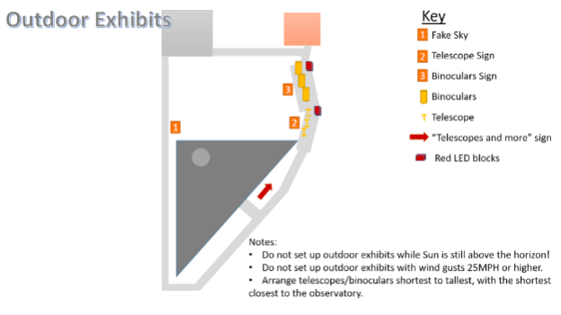

- [Indoor Exhibits](#indoor-exhibits)
  - [Setup Procedure](#setup-procedure)
  - [Shutdown Procedure](#shutdown-procedure)
- [Outdoor Exhibits \& Constellation Tours](#outdoor-exhibits--constellation-tours)
  - [Outdoor Exhibits](#outdoor-exhibits)
  - [Constellation Tour](#constellation-tour)
- [Exhibits Information](#exhibits-information)
  - [Virtual Reality Goggles](#virtual-reality-goggles)
  - [Apollo Box (Apollo, Solar System Potpourri, What's in the Milky Way, Exoplanets)](#apollo-box-apollo-solar-system-potpourri-whats-in-the-milky-way-exoplanets)
  - [Features Box (Lunar Features, Parts of a Black Hole, Martian Spacecraft, Solar Features, Telescopes)](#features-box-lunar-features-parts-of-a-black-hole-martian-spacecraft-solar-features-telescopes)
  - [Small Touch Screens](#small-touch-screens)
  - [Computer Games](#computer-games)
  - [Spectrum Table](#spectrum-table)
  - [A Day on the Moon](#a-day-on-the-moon)
  - [Fun with Light – Complementary Colors](#fun-with-light--complementary-colors)
  - [Fun with Light – Primary Colors](#fun-with-light--primary-colors)
  - [Fun with Light – Prisms](#fun-with-light--prisms)
  - [Light Trap Panels](#light-trap-panels)
  
---

## Indoor Exhibits

The interaction an Observatory staff member has with people in the exhibit area can vary from essentially none at all to some fairly extensive discussions. Be familiar with the current displays and be available for questions or discussion. Conversations with other staff members should be put on hold when a guest enters the room in order to welcome them. Remember, we are there for them!

1. Permanent Exhibits may include the VR goggles, the Apollo box, the Features box, the Fun with Light table, the Activity Center, the Spectrum Table, the A Day on the Moon exhibit, the small touch screens, and the computers. Though the layout of the displays look the same, the information within the Apollo box and the Features box can be switched out to match a program theme just like it can on the small touch screens. The computers current run multiple applications with varying ease of use. Be prepared to help people as best as you can. See [Exhibits Information](#exhibits-information) for specific information about permanent exhibits.

2. Rotating Exhibits will be changed regularly throughout the year depending on what objects are visible in the sky, on-going NASA missions, and other celestial phenomenon (e.g. eclipses, meteor-showers, etc.). Topics will include featured constellations, at least one Solar System object, deep space objects (e.g. Messier Objects), general astronomy or history, NASA missions (past and present), and telescopes. Specific exhibits include, the light trap panels, the overhead light panels, the moon globe, and 3D models of lunar craters, etc. See [Exhibits Information](#exhibits-information) for specific information about rotating exhibits.

[top](#)

### Setup Procedure

1. Turn on wall lights using rocker switch on the opposite wall of the doors to enter the dome.

2. Turn on AC/Heat and Computer switches on the wall to left as you enter to Exhibit Room. They are labeled. Note: The Computer switch must be turned on before the Fun with Light table or the computers may not turn on.

3. Turn on light switches for overhead lights using the 4-switch light switch to the left of the Exhibit Videos monitor.

4. Inside the white box to the left of the Exhibit Videos monitor, turn on the power strip, then use the remote control to select the input for the thumb drive of Messier objects.

5. Switch on the power strip to the right of the Exhibit Videos and speakers then use the remote to power on the Exhibit Videos monitor. The video playlist should automatically start. Be sure to return remote to the top of the white box. This power strip also provides power to the small rocket models lighting.

6. Open an app on each computer. See [Computer Games in Exhibits Information](#computer-games) for app descriptions.

7. Power on the LAPO Kiosk using the power switch located on the back right of the kiosk.

8. Turn on the One in a Million exhibit using the rocker switch on the bottom of the background panel on the right-hand side.

9. Turn on the Apollo Box using the rocker switch inside the hole, located on the lower left edge of the unit.

10. Turn on the Fun with Light table using the light switch on the lower-left side on the side closest to the Apollo Box.

11.	Turn on the power strip on the floor to the left of the Saturn V rocket model display.

12.	Turn on the exhibits in the Starlight room using the light switch the very left corner of the room. If desired, turn the dimmer for the overhead light to aide in visibility of the displays. This will also turn on the lights inside the Space Shuttle Challenger display.

13.	Turn on the Features Box using the push button in a hole at the bottom of the display.

14.	Turn on Richard’s Planisphere using the rocker switch on top of the display.

15.	Turn on the Space Mission Status vertical display monitor using the power strip switch beneath the monitor.

16.	Make sure the Activity Table components are ready for use.

17.	When there are just a few minutes left before opening, grab the phones for the VR goggles from the charging station on the office desk and open an app on each one. Install them in the VR goggles. Check them throughout the night to make sure the apps don’t freeze and the batteries don’t die. Replace phones as necessary with the backups in the office.

[top](#) 

### Shutdown Procedure

1.	Exit out of each app open on the computers and shut them down. Go to the Windows icon, then the Power icon and select Shutdown.

2.	Turn off the Power Strip switch to the Space Mission Status display (vertical monitor).

3.	Turn off the rocker switch on the top of Richard’s Planisphere.

4.	Turn off Features Box using push button in a hole at the bottom of the display.

5.	Turn off the exhibits in the Starlight Room (and overhead light, if it was turned on) using the light switch the very left corner of the room. This will also turn of the lights to the Space Shuttle Challenger display.

6.	Turn of the switch on the power strip on floor next to the Saturn V rocket model case.

7.	Turn off the Fun with Light table using the switch on the lower-left side on the side that is closest to the Apollo Box.

8.	Turn off the Apollo Box using the rocker switch inside the hole, located on the lower left edge of the unit.

9.	Turn off the One in a Million exhibit using the rocker switch on the bottom of the background panel on the right-hand side.

10.	Turn off the LAPO Kiosk using the light switch located on the back right of kiosk box.

11.	Turn power off to the Exhibit Video TV power strip.

12.	Do not unplug the power strip from the wall.

13.	Turn off the power strip inside the white box on the wall to the left of the Exhibit Videos monitor. This power strip provides the power to the 74” display on West wall.

14.	Return VR goggles to charging station in office.

15.	Turn off the overhead lights using the 4-switch light switch to the left of the Exhibit Videos monitor.

16.	Turn off AC/Heat and Computer switches on the wall to left as you leave to Exhibit Room. They are labeled.

17.	Turn off wall lights using rocker switch on the opposite wall of the doors to enter the dome.	

[top](#)

## Outdoor Exhibits & Constellation Tours

### Outdoor Exhibits

Only set up the outdoor exhibits if the sun is below the horizon and the forecast shows no wind gusts over 25mph. If the wind picks up or if it starts raining put the exhibits away immediately. All exhibits should be returned to the shed at the end of the night. Turn off the lights and lock the shed before leaving. Give the handle a good tug to make sure both doors are completely locked. Arrange the exhibits as indicated below:

[top](#)

### Constellation Tour
It is best to begin with a bright or well-known constellation or asterism (i.e. Orion or the Big Dipper). This will give people something to help orient themselves. Use a laser pointer (if available) to outline the constellation. Feel free to add mythology or stories about that constellation and point out any well-known features (a double star, a nearby cluster or galaxy, etc. Using features within that constellation, help them find another one close by (ex: “Follow the arc of the Big Dipper to Arcturus”, or follow the end of the Big Dipper to the North Star to find the Little Dipper). If this is not possible, simply move on to another nearby constellation. Continue around the sky until you reach the starting point. Feel free to use an app on your phone or a sky map with a red light until you are comfortable doing it by memory. Practice makes perfect. Below are the Northern hemisphere constellations by season:

|**Season**|**Constellations**|
|---|---|
|**Winter**|Canis Major, Cetus, Eridanus, Gemini, Orion, Perseus, Taurus|
|**Spring**|Boötes, Cancer, Crater, Hydra, Leo, Virgo|
|**Summer**|Aquila, Cygnus, Hercules, Lyra, Ophiuchus, Sagittarius, Scorpius|
|**Fall**|Andromeda, Aquarius, Capricornus, Pegasus, Pisces|
|**Circumpolar** (Up all year)|Cassiopeia, Cepheus, Draco, Ursa Major (includes Big Dipper), Ursa Minor (the Little Dipper)|s
  
---

[top](#)

## Exhibits Information

### Virtual Reality Goggles
**Purpose**: Provide users with the ability to explore and learn about constellations and solar system objects in a virtual 3D world.

**What to See and Do**: Currently, there is an app for identifying constellations, “roving” the surface of the moon, experiencing a Falcon 9 lift-off, exploring the Solar System, and generating 3D augmented reality graphics of various NASA spacecraft.

**Suggestions of What to Do**:

**Questions/Comments**: Encourage people to use the swivel chairs when using the goggles. Many people become disoriented and have trouble maintain balance.

[top](#)

### Apollo Box (Apollo, Solar System Potpourri, What's in the Milky Way, Exoplanets)

**Purpose**: Currently this box houses four different exhibits:

- **Apollo Lunar Landings**: this exhibit shows people where on the moon each of the Apollo landings occurred. When a visitor presses a button for a particular flight, a window lights up displaying information about that flight. Apollo flights 11-17 are covered in the exhibit.

- **Milky Way**: This exhibit explores the different types of objects found in the Milky Way galaxy – planets, diffuse nebula, planetary nebula, open clusters, globular clusters, et cetera. A poster with top and side views of the galaxy occupies the center of the exhibit. Numbers on this poster correspond to an object type. When the corresponding button is pressed information about that type of object lights up.

- **Solar System Potpourri**: This exhibit explores different planetary features. A basket of numbered features (lightning, rings, clouds, volcanoes, many moons, hurricanes, and craters) occupies the center of the exhibit. When a number corresponding to one of the features is pressed, information about that feature and where it is found is displayed.

- **Exoplanets**: This exhibit explores a variety of theorized types of exoplanets and how they are discovered. It includes artist renditions of the planets based on scientific data collected by various means (calculated densities and spectral analysis of the planet’s atmosphere).

**What to See and Do**: Press the number of the button that corresponds to the item you are interested in. The appropriate window will light up and stay on for about 20 seconds.
Suggestions of What to Do:

**Questions/Comments**: Only one feature can be lit at a time. Often, people will press a button when a window is lit. Simply explain to them that only one window can be lit at a time, and to wait until it goes out and then press another button.

[top](#)

### Features Box (Lunar Features, Parts of a Black Hole, Martian Spacecraft, Solar Features, Telescopes)

**Purpose**: This exhibit involves selecting a term by rotating an arrow and matching it to the corresponding picture. If the correct picture is chosen, the picture's caption lights up when the button under the picture is pressed. The different topics that this exhibit can house include:

- Lunar Features: Craters, rayed craters, secondary craters, mare, highlands, and rille.
- Solar features: Sunspot, flare, prominence, granulation, disk.
- Parts of a Black Hole: Accretion disk, singularity, event horizon, companion star.
- Martian spacecraft: Match a photograph or art depicting a spacecraft with a picture of Mars taken by the spacecraft.

**What to See and Do**:

**Suggestions of What to Do**:

**Questions/Comments**: On occasion, the arrow becomes loose, so if there appears to be a problem with the exhibit, this should be the first thing to check. A small-diameter screw holds the arrow to the mounting shaft.

[top](#)

### Small Touch Screens

**Purpose**: These exhibits feature interactive, informational slideshows of various objects and topics.

**What to See and Do**: Users can search multiple slideshows with facts and pictures. They simply swipe left or right to move to the next slide, swipe up for additional information (if available), or swipe down to return to the main slide show.

**Suggestions of What to Do**:

**Questions/Comments**:

[top](#)

### Computer Games

**Purpose**: These exhibits feature interactive games and simulators.

**What to See and Do**: Each computer has a different selection of games. 
The current selection includes:

- Shocktopus (ages 4+)
- Space Engine (ages 10+)
- Kerbal Space Program (ages 8+)
- Stellarium (ages 8+)
- Universe App (ages 8+)
- Messier List (ages 8+)
- The Universe (ages 6+)
- Mars Rover: Curiosity (ages 6+)

**Suggestions of What to Do**:

**Questions/Comments**:

[top](#)

### Spectrum Table

**Purpose**: to demonstrate to people in an interactive setting that different gases have different patterns of spectral lines. These differing spectral line patterns can then be used as a “fingerprint" of each gas.

**What to See and Do**: The user in the spectrum exhibit can push the various buttons on the exhibit table. Each button corresponds to one of the five gas tubes. The uppermost button operates the white light bulb and this is used to show a continuous spectrum of rainbow colors.

While holding down one button, the participant should look at the glowing gas tube through one of the plastic spectrum grating paddles handing at the side of the exhibit table. He or she can then look at some of the other gas tubes in the same manner. Each gas tube will show a line pattern that is different from the other four in both the color and position of the lines. The difference in line patterns from one gas to the next can be used to identify the different gases. A spectrum can be thought of as a "fingerprint" of the gas that is producing it.

**Suggestions of What to Do**: Compare the gases with each other through the spectrum grating paddle. Also look at the white light bulb through the paddle. Do all gases show the same pattern of bright lines? Are all lines the same color and brightness from one gas to another? Why is this principle of different line patterns in different glowing gases important to scientists?

If people have trouble seeing the lines, make sure they are looking through the paddle and then off the left or right.

**Questions/Comments**: What do I do? Look at the gas tubes through the spectrum grating paddle and without it. What do you notice?

> **Note**: Tactfully discourage youngsters from pounding the buttons. The spectrum exhibit is not a video or pinball machine!

[top](#)

### A Day on the Moon

**Purpose**: To show people how the appearance of a small piece of the moon's surface changes as the moon goes through its monthly cycle of phases.

**What to See and Do**: An arch-shaped enclosure contains a model of one piece of the moon's surface, located near the center of the moon's disk, around the crater Triesnecker. This model has been sculpted so it is a true representation of the width and depth of the craters. Participants can touch the model to see that the craters are actually quite shallow. This model can be illuminated from five different angles by pressing one of the five buttons on the exhibit. These buttons are labeled sunrise, Morning, Noon, Afternoon, and Sunset, to show how the surface of the moon would be illuminated at different times during a day on the moon.

[top](#)

### Fun with Light – Complementary Colors

**Purpose**:

**What to See and Do**: Hold different colored filters in front of the colored windows to try and figure out what primary colors make up each complementary color. Since a colored filter absorbs all colors of light except those which it is made of, it's possible to do this. For example, if one of the complementary colors turns blue when the blue filter is held in front of it and red when the red filter is held up, you know that particular complementary color must be made up of red and blue. In the table below are the three complementary colors and the colors which can be seen when each of the six filters is held in front of them.

|Filter|Magenta|Amber|Cyan|
|---|---|---|---|
|Red|red|red|none|
|Green|none|green|green|
|Blue|blue|none|blue|
|Magenta|magenta|red|blue|
|Amber|red|amber|green|
|Cyan|blue|green|cyan|

 

**Suggestions of What to Do**: What do you think will happen if you put the blue filter in front of the windows? Why did the amber disappear and the other two change colors? Try a different filter. When the visitor has reached the point that he or she can guess what colors make up each complementary color, they can verify their guess by mixing the two colors they guessed at the primary color station.

**Questions/Comments**: The mirrors can be used here for color mixing also.

[top](#)

### Fun with Light – Primary Colors

**Purpose**: What to See and Do: Use the mirrors to reflect the different colors onto the white screen. By overlapping the colors on the screen, you can mix them together to form new colors. The various combinations are:  

- red + green = amber (yellow)
- red + blue = magenta (pinkish purple)
- green + blue = cyan (bluish green)
- red + green + blue = white

> **Note**: amber, magenta, and cyan are the complementary colors.

Red, green, and blue are called the primary colors because any other color can be made using various combinations of just these three. The six colored filters can also be used at this station. The filters only transmit the colors of light which they contain and subtract out all others. The colors which get through each filter are shown below.

|Filter|Red|Green|Blue|
|---|:---:|:---:|:---:|
|Red	|X	|	|  | 
|Green	|	|X	|  | 
|Blue	|	|	|X |
|Magenta|X	|	|X |
|Amber	|X	|X	|  |
|Cyan	|	|X	|X |

 

**Suggestions of What to Do**: What do you think will happen when you mix red light and green light together, any other two colors together, or all three colors?

**Questions/Comments**:

[top](#)

### Fun with Light – Prisms

**Purpose**: What to See and Do: Place the prism in the path of the light rays. Depending upon how the prism is turned, all the light rays will be bent one way, half one way and half the other way, or in some cases, some of the rays will be totally reflected on an inside surface and leave the prism through another side.

**Suggestions of What to Do**: Notice that part of the rays reaching the prism are reflected off the front surface of the prism.

**Questions/Comments**: Why do I get a spectrum (rainbow effect) from only one ray instead of all of them? The angle between the prism and ray must be a certain value. Only one ray at a time meets this criterion. Can you turn the prism to try to get a spectrum with a different ray?

[top](#)

### Light Trap Panels

**Purpose**: The light trap gives people a chance to see photographs of some of the objects that are being viewed in the evening's program.

**What to See and Do**: There are slides for numerous topics for the light trap: Moon, Venus, Mars, Jupiter, Jupiter's Moons, Saturn, Saturn's Moons, Uranus, Neptune, Life of a Star, Groups of Stars, Galaxies, Summer Constellations, and Telescopes.

**Suggestions of What to Do**:

**Questions/Comments**: If people are asking about objects that are displayed in the light trap, by all means direct them to the photographs. Each photograph has a caption and should be fairly self-explanatory.

Why are the photos in the light trap better than what we see through the telescope? Some of the photographs were taken by spacecraft that flew by planets. Other photographs are long exposures through large telescopes that capture more light than our eyes. Many were taken above earth's atmosphere or in places with very steady air.

**Suggestions of What to Do**: If you are showing visitors views of the moon with the telescope, it is a good idea to suggest to people that they should examine this exhibit. A good lead-in is to point out that the craters on the moon are best seen when the moon is not full, and that they show up best on the parts of the moon where the sun is just rising or setting. A Day on the Moon illustrates these points.

**Questions/Comments**: At what times of the lunar day do the craters show up the best? There is a flat, darker region on the model. At what time of the lunar day is it easiest to distinguish that area from the lighter areas? Is full moon necessarily the best time to observe the moon through a telescope? What is the best part of the moon to look at through a telescope if you want to see craters?

 

&raquo; Next Section: [What If?](/volunteer-handbook/handbook/what-if/)
