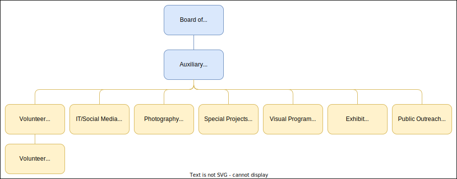

 

   

## Board of Directors

A five-member ***Board of Trustees*** is responsible for overseeing the operation of the Observatory. Sedgwick County maintains a seat on the Board. 

The ***Auxiliary Board of Directors*** has unique areas that each member oversees. Each member of the Auxiliary Board reports to a designated member of the Board of Trustees. 

### Volunteer Director

Oversees the organization and distribution of information for the volunteer staff including monthly schedules, training, and educational materials.

### IT/Social Media Director 

Oversees maintenance of the website, all social media outreach channels, PR-related documents, and all IT equipment. 

### Special Projects Technical Director 

Oversees the design and construction of special projects as requested by the Board of Trustees or fellow members of the Auxiliary Board of Directors. 

### Visual Program Director 

Plans and compiles the object lists for each night. 

### Exhibit Director

Oversees development, organization, maintenance, and planning of upcoming exhibits. 

### Private Event Director

Oversees coordination, planning, correspondence, and operation of private events. 

If you have a skill set that could benefit one of the above positions, let us know. We are always looking to build teams to support the Auxiliary Board of Directors since most of us work full-time jobs outside of the observatory.
