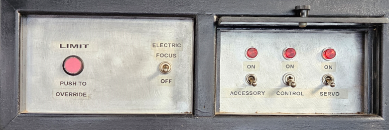
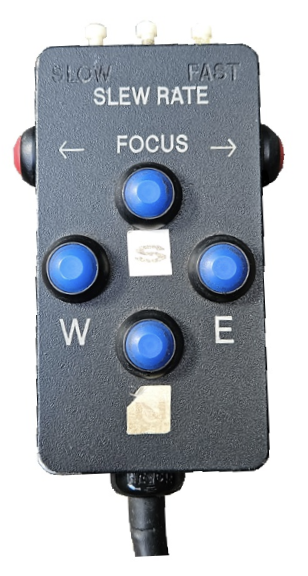
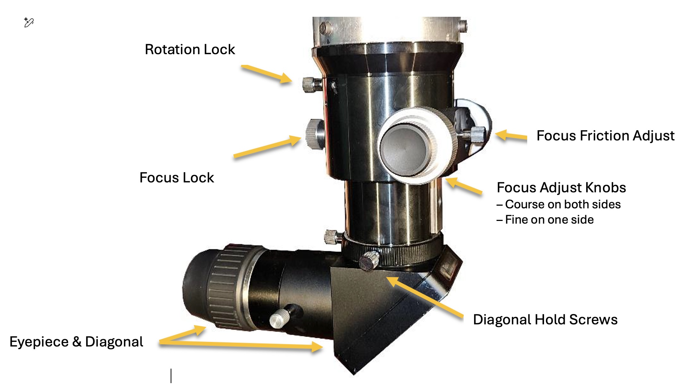

- [Start-up Procedure](#start-up-procedure)
- [Shut-down Procedure](#shut-down-procedure)
- [Telescope Focuser](#telescope-focuser)
- [Troubleshooting Tips](#troubleshooting-tips)
  
---

[top](#)

### Start-up Procedure

1. Open the Observing Slit in the Dome. Release the latch at the bottom center of the slit and crank the bifurcating shutters apart. Do not open the shutters in winds of more than 30 mph! Be sure to allow sufficient time for the interior temperature to equalize with the outside temperature.

2. If there is resistance, do not force the shutters open. Find the problem and fix it. Very rarely, a bird will build a nest in the top overhang of a shutter, causing an opening or closing problem.

3. If one must go on the roof to fix a shutter problem, ensure that NO sharp objects contact the roof. The roof is a rubber membrane. Tiny punctures may be patched; tears usually make replacement necessary.

4. Plug in the PC at the desk using the power switch behind the monitors.  

5. Turn on the telescope by plugging in the power cord at the base of the telescope, then switch on all three switches.  
    
    

    > **NOTE**: the middle switch must be pulled out to toggle it.    

6.  After Windows loads, launch **SiTechExe** and verify communications with the telescope controller

7.  Click **StrtUpTrkg** or **Start** in the **SiTechExe** window if not already started

8.  Launch **Sky Tools** or click on **SkyView** in the SiTechExe window

9.  **Course Alignment** (Optional): if the telescope was previously shutdown pointing straight up (Zenith) then you may do a course alignment to Zenith.  
    
    - Using **SkyView**: Find the small yellow "+" at the exact center of the chart (zoom in for accuracy with the mouse wheel).  
    - Right-click on the "+" and select "**GoTo or Sync...**, 
    - then click the **Sync** in the pop-up window 
    - ... and then **OK** in the **InitPoint** window.

10.  Removing the dust covers: Use the hand-controller to move the telescope down to the East at about a 30-degree angle. You can press **S** and **E** at the same time lower the telescope and remove both the main scope and finder scope covers.
  
   

11.  Precision Alignment:  Looking outside, find and identify a bright star (preferred) or planet.  
     Once course aligned (see above), you may select a target star and do a **GoTo** using **Sky Tools** or **SkyView**.  

     Center the star in the telescope's eyepiece using the hand-controller:
     - Center it in the Telrad
     - Center it in the Refractor
     - Center it in the Main Scope
     - Using **SkyView**: Click on that star in the chart. 
     - Click on **Sync** in the first pop-up window.  
     - Click on **OK** in the **InitPoint** pop-up window.

     > **NOTE**: first two bullet points may not be necessary if your course alignment was good.     
  
12.  Ready for Observing!

13.  Turn on lights underneath the top step of the ladder to assist guests. 

14. The lights along the walkway are dimmable. The dimmer slide is to the right of the four telescope monitors.

--- 

[top](#)

### Shut-down Procedure

1.  Install the dust covers - Use the hand control to move the telescope down to the East at about a 30-degree angle. Use the steps if necessary to install both the main scope and finder scope covers.

2.  Use **Sky Tools** or **SkyView** to find and slew the telescope to Zenith (pointing directly overhead).

3.  Turn off the telescope power by toggling off all three switches below the telescope.  
    
    > **NOTE**: The middle switch must be pulled out to toggle it.

4.  Unplug the power cord at the base of the telescope.

5.  Close all programs on the PC. Shut-down Windows and turn off the power switch (light switch) located behind the monitors.

6.  Position the opening of the dome to the South. Close bifurcating shutters and lock them using the latch at the bottom center of the slit.

--- 

[top](#)

### Telescope Focuser

LAPO recently acquired a new focuser for the 16 inch telescope. This focuser was quickly installed and seemed to work fairly well. But, recently we began to notice that it wasn’t moving at all in some cases. Investigation revealed that an internal coupling connecting the two sides of the focus knob shaft had come loose. This prevented one of the two focus knobs from working. We were able to get everything reconnected and cleaned. Damage like this could have been prevented with proper care and knowledge of how to properly use this focuser.

**Rotation Lock**: Prevents rotation of the entire focuser. Usually this does not need to be tight. **ALWAYS** rotate the entire focuser rather than just the diagonal when adjusting the view direction. You should never need to loosen the diagonal hold screws until you are ready to remove the diagonal and eyepiece at the end of the evening.  

**Focus Lock**: Prevents focusing. This large set screw is sometimes needed if the focus shaft unintentionally moves on you or if you need to prevent visitors from bumping the focus. **ALWAYS** ensure the focus lock is loose before adjusting focus.  

**Focus Friction Adjust**: This small adjustment screw is **ONLY** used to set the proper friction so the focus barrel will extend and retract smoothly. Ideally it should never be touched, but may require occasional adjustment if the focuser slips or fails to move properly. **NEVER** use the Focus Friction Adjust as a Focus Lock.  

You already understand how the focus knobs work, but it needs to be clear what not to do. Use the two-finger rule when focusing. This means that if you can’t easily focus using just your thumb and index finger on one hand, then adjustments need to be made. **NEVER** try to overpower the focus lock or an improperly set Focus Friction. If you can’t rotate either focus knob with just two fingers (thumb & index) then find out what the problem is. This is very likely how our focuser was recently damaged.

--- 

[top](#)

### Troubleshooting Tips

- **Over Limit** - Our Telescope Control System has TWO overlimit protection systems.  

    When the PC is properly synced to the telescope, SciTechEXE will not allow you to slew to an object below 10 degrees above the horizon.

    When the telescope physically moves too low, mercury switches on the telescope detect this and stop all motion. This is when the OverLimit pushbutton starts to flash.

    **Ways to get into Over Limit**

    - Intentionally with the Hand Control – Perhaps when removing the covers.  
    - The Telescope is out of Sync with the PC.  
    - Tracking beyond the limit when viewing an object low in the West.  
    - If SiTechExe is displaying “Below Horizon Limit” and won’t start up Tracking, it may be necessary to open SkyView and Sync to an object overhead before you can do anything else.  
     

    **How to get out of Over Limit**

    You select an object at the PC then tell the computer to slew to it, but the telescope moves too far and the Overlimit light starts to flash.  
    Always perform these steps in this order…

    - Click STOP in the SciTechEXE Window to cancel the Go-To Command
    - Reset the telescope controller fault (Blinky Mode) - if necessary
    - Hold the Overlimit pushbutton and use the Hand Control at Pan speed to move the scope to a more vertical position.

    > **NEVER** hold the Overlimit button and use the PC to move the telescope.  
    > The PC is no longer sync’d to the scope – ***Don’t trust it!***

     - Center on a new object and Re-Sync the telescope to the PC.  
     

- If SiTechExe is not communicating with the Scope Controller (Bad Scope Commun and/or Faking Servos), first click on the Config Tab and then Cycle Comm Port. You may also click the Change Config button and then check under the Misc tab to confirm a valid Comm Port is selected. If this doesn’t work check the USB cable into the back of the PC. It may also be necessary to restart the PC and cycle the CONTROL power switch below the telescope. The LED near the top right on the controller mounted behind the telescope will be flickering when the controller is communicating with the PC.

- If either axis of the telescope fails to move, especially following an oscillation, it may be necessary to reset the controller. The following are ways to confirm that the software has detected a fault:

    - Check the two red LEDs on the left side of the controller box mounted behind the telescope. Normally, both will be on steady. When an axis is failed, one of these LEDs will be flashing (RA LED is upper, Dec is lower).

    - Look at the bottom of the SiTechExe window which will probably show the motor(s) in “Blinky” mode (meaning the LED on the controller is blinking).

    - To see more detail regarding what caused the fault, open the Features Tab in SiTechExe and click on Controller Stuff. A new window will open which shows which axis was affected and the exact software monitor which shutdown the servo motor.

- The easiest way to reset a fault is to simply click on the lowest button in the SiTechExe window (Scope tab), however some faults may require a complete reset of the CONTROL power switch below the telescope. Please write down details about what the telescope was doing before the fault, or even better, take a picture of the Controller Stuff window before you reset, to aid in troubleshooting later.

> **ATTENTION**:  Under NO circumstances should the counter weights be brought across the top of the polar axis! If this occurs, the cables which provide power to the motors which move the telescope, and other computer cables, will become wrapped around the axis, stretch, and finally break, disabling the telescope.

 

&raquo; Next Section: [Telescope Tour](/volunteer-handbook/handbook/telescope/telescope-tour/)
