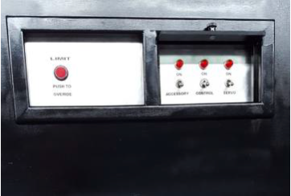
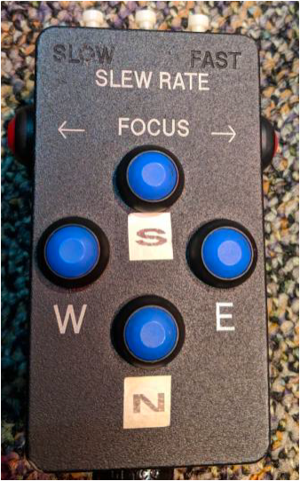
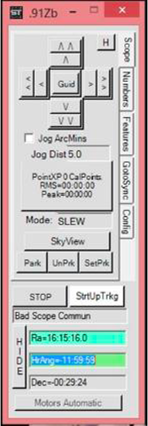
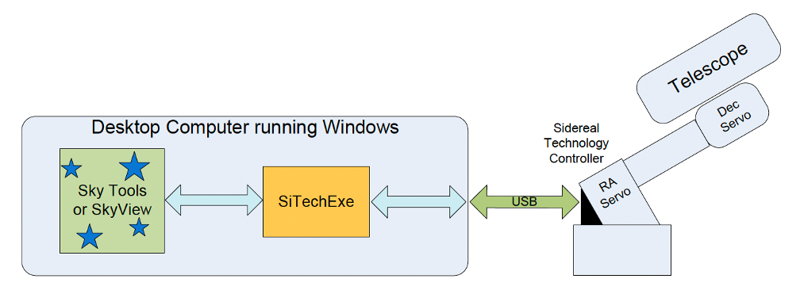
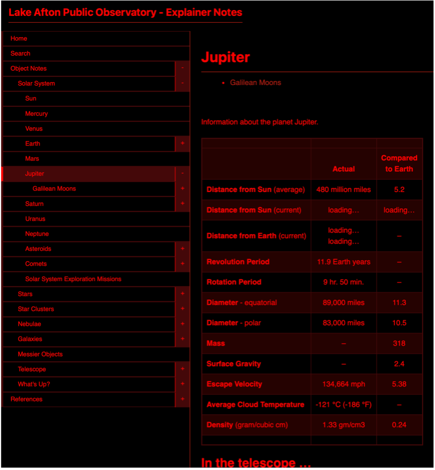
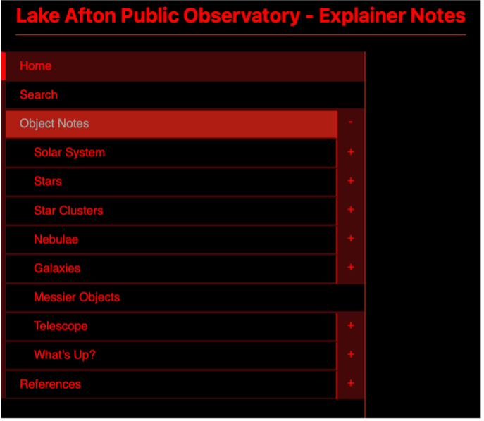

- [Hardware](#hardware)
- [Software](#software)
  - [SiTechExe](#sitechexe)
  - [Sky Tools 3](#sky-tools-3)
  - [Explainer Notes](#explainer-notes)
  
---

[top](#)

The telescope may be controlled manually via the hand controller or from the PC using astronomy charting software such as Sky Tools 3. Refer to the Startup or Shutdown checklist for the specific power up or power down procedures.

[top](#)

### Hardware
On the control panel below the telescope, there are three power switches that power different aspects of the system. All three switches must be powered on for normal telescope operation and all three must be turned off when shutting down. The power cord below the control panel powers everything and should be unplugged when the telescope is not in use.

    

- **ACCESSORY Power** – Provides power for all lighting such as the telescope’s Hour and Dec angle, illuminated reticles, Telrad, etc.

- **CONTROL Power** – This switch provides primary telescope control power 
  
    > **NOTE**: This switch is lever locked Pull out slightly on the switch to move it. If Control Power is switched off during normal operation, the scope will lose alignment.  
  
- **SERVO Power** – Provides power to the servo motors through the controller. Servo Power may be switched off at any time to stop telescope motion without losing scope alignment.

    Once power is applied to the system, the controller goes through a short initialization sequence. Once the hand controller becomes active you can move the telescope.

- **LIMIT** – The Limit system functions by stopping all motion before the telescope reaches a horizontal position. When this occurs, the red Limit pushbutton will flash. To override this condition, push and hold the Limit switch while carefully moving the telescope to a more vertical position.

    > **WARNING**: If you have an over-limit condition during an automated slew from the computer you must cancel/stop that slew before pressing the limit override. Failure to do so will result in the telescope continuing to slew to the requested object as soon as you press override.

- **HAND CONTROLLER** – Manually controls movement of the telescope in 4 directions (N, S, E, W), focus (side button) and the slew rate of the telescope (3 buttons on top). 

    

[top](#)

### Software

You may launch **Sky Tools**, **SkyView**, or any other charting application at any time while activating the scope, but you cannot align until the Scope controller and **SiTechExe** are both running and communicating without errors.

[top](#)

#### SiTechExe

Once the controller is on and the PC has finished booting up in Windows, double click on the SiTechExe icon. This program allows the telescope controller to communicate with Sky Tools or other charting programs. Even if SiTechExe (small window shown below) is not be used to control the scope, the program must always remain active while using Sky Tools.

    

There are several features on the **iTechExe** window that you should be aware of…

- Tabs along the upper right side display different system aspects. 
Typically, only the Scope tab will be used.

- At the center of the Scope Tab window the Mode: shows the current speed selected for the hand controller. Press the button at the top center on the hand controller to toggle through ***Slew***, ***Pan***, and ***Guide*** speeds. Slew is the fastest, Guide is the slowest. A voice will also announce the current speed.

- Toward the top of the Scope tab are directional controls to move the telescope. Click and hold on the single arrows for pan speed and on the double arrows to move at slew speed.

- In the lower half of the window is a STOP button and another button alongside it which is used to restart telescope tracking. Click on STOP any time you want or need to stop the telescope from moving.

- Immediately below the STOP button is a status window which will alert you to potential issues with controlling the scope.

- **SkyView** is a basic sky chart application within **SiTechExe** and is discussed in more detail below.

On the **SiTechExe** window, click the button labeled ***Start*** or ***StrtUpTrkg*** to start moving the telescope’s RA axis at sidereal rate, which means any object in the eyepiece will be tracked even before the scope is aligned.

    
 
The diagram above shows the communication path between the telescope and **Sky Tools** or **SkyView**.

You may align (Sync) to any visible object in the chart database, but an easily identified bright
star is preferred. For the most accurate alignment, choose a star near zenith.

Embedded within **SiTechExe** is a basic sky chart application called **SkyView**. This feature, activated from the **SkyView** button (Scope Tab), supports full go-to operation and a database of all the objects we would likely view in our telescope. The chart shows everything currently in view overhead and it continually updates over time.

- Once you have a known object in the eyepiece, you can easily align the telescope by finding and clicking on that object in the chart and then clicking on Sync in the window that pops up. After that, click OK in the InitPoint window that pops up. A voice will announce “Offset Init”.

- To move the telescope to any object, first click on that object and then click GoTo in the window that pops up.

- Use the scroll wheel on the mouse to zoom in and out (centered on the mouse location), the keyboard arrow keys will pan left/right/up/down, and you can click and drag a box to define a new view area.

- When you mouse over an object, information for that object is given in the lower right corner of the window.

- Menus across the top of the window allow you to select objects for display and filter by magnitude. A Search feature is also available. Most features are self-explanatory.

You should always watch the **SiTechExe** window in addition to the telescope during any GoTo operation. If the status continues to show “Slewing” several seconds after the telescope has stopped moving, then click STOP and then restart tracking. As with any equatorial mount, be prepared for prolonged slew times with operations near the North Star as the RA axis requires more angular displacement for less apparent movement.

[top](#)

#### Sky Tools 3

- Double click the Sky Tools shortcut on the lower left monitor to launch the program.  
  
- There are 5 tabs across the top of the display. Options for telescope control are on the Real Time tab.  

- Select the appropriate Group and List to view the object list for the current program. Each weekend throughout the year has its own list and theme.   

- Click on “Telescope Control” and then “Connect to Telescope” to connect Sky Tools to the telescope.  

- You can then right click on any listed object and select Slew Scope to (F3). Be sure the telescope pier is clear of people and the step ladder before moving the telescope.  
 
 [top](#)

#### Explainer Notes

An online database is available for access by volunteers from home or their mobile device: 

> [LAPO Explainer Notes](https://lake-afton-public-observatory.github.io/lapo-explainer-notes/)  

These notes are also available on the computer in the observing room. 

The upper left-hand monitor is usually where the Explainer Notes are displayed. This is a database of information of many of the objects that we will show the public through the telescope. Our guests are here to learn about what they are looking at. Share this information with them. Feel free to use it as a reference to answer their questions as well. 

    

1.	The left navigation panel contains a menu with information grouped by object type. Clicking on a type of object will take you to a page displaying detail about the selected object. Including information about the object, recommended eyepieces and what to look for when viewing the object in the telescope.

        

2.	Information about the Telescope is also available to share with guests during a telescope tour on cloudy nights. Including details about how to operate, eyepiece magnification, telescope specifications and information about the other telescopes attached to the main 16”.

3.	Most of the Object pages contain a link to images of the object being viewed.  Clicking the “-- what’s up? --” link in the upper-right to open a separate window containing an image of the selected object to display on the exhibit room monitor. 

        

    NOTE: This feature is only available from the LAPO Telescope computer.

[top](#)
